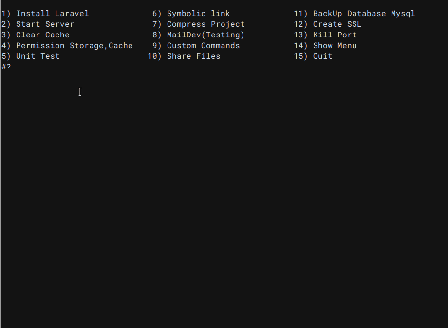

## Laravel Bash Tools
 


>    `LaraBash`  help you to speed up workflow in your Project its contains top commands and tools 
 like mail,backup,custom commands..etc  used by Backend Developers - Laravel


---

 

## ✨ Menu LaraBash 
    .
    ├── Install Laravel               ✔ Select And Install Laravel Version
    ├── Start Server                  ✔ Run PHP Built-in web server 
    ├── Clear Cache                   ✔ Clear Laravel Cache
    ├── Permission Storage,Cache      ✔ Setup File Permission for laravel
    ├── Unit Test                     ✔ Run PHP UnitTest
    ├── Symbolic link                 ✔ generate symbolic link to store your files in the storage directory 
    ├── Compress Project              ✔ Compress All Files and Directories
    ├── MailDev                       ✔ Install And Run Smtp Mail for testing 
    ├── Custom Commands               ✔ Execute commands save in  config.conf file
    ├── Share Files                   ✔ Share files using cli - https://transfer.sh/
    ├── BackUp Database               ✔ Backup database mysql needs host,user,dbname,pass
    ├── Create SSL                    ✔ generate ssl certificate for local Development
    ├── Kill Port                     ✔ destroy any Open Port 
    ├── Show Menu                     ✔ Show Menu List
    └── Quit                          ✔ exit bash


### How it Work

``` bash

chmod +x lara.sh

./lara.sh

```

## Contributing
- ⚙ Send us a PR, github issue, or email at app_eg@mail.com
